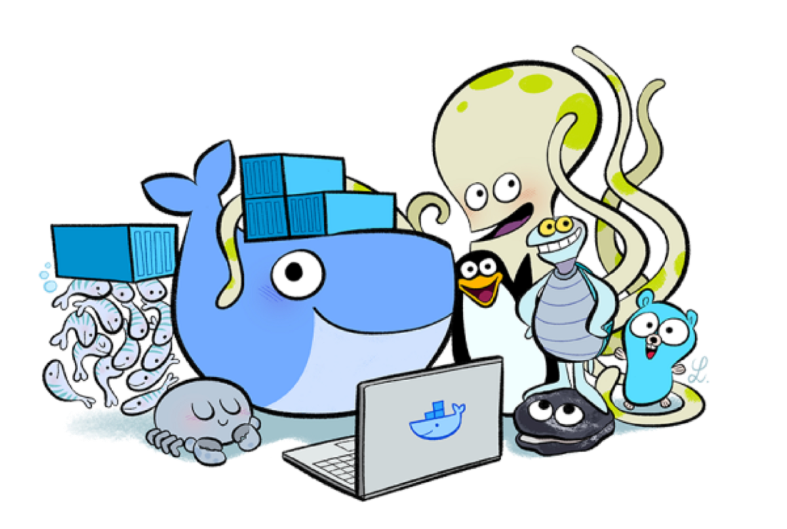

# Devops-Utils

In this repository you will find code snippets and documentations to help you starting your project as a DevOps.

## <a href="./Infrastructure/infrastructure.html">Infrastructure</a>

* <a href="./Infrastructure/MicrosoftAzure/azure.html">MicrosoftAzure</a>
* <a href="./Infrastructure/AmazonWebServices/aws.html">AmazonWebServices</a>

## <a href="./Containers/containers.html">Containers</a>

* <a href="./Containers/Docker/docker.html">Docker</a>
* <a href="./Containers/Kubernetes/kub.html">Kubernetes</a>

## <a href="./Security/security.html">Security</a>

* <a href="./Security/Nginx/nginx.html">Nginx</a>
* <a href="./Security/TransportLayerSecurity/tls.html">TransportLayerSecurity</a>